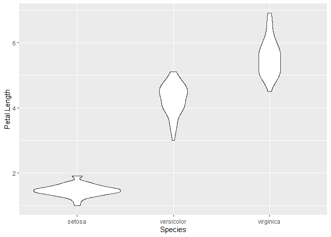
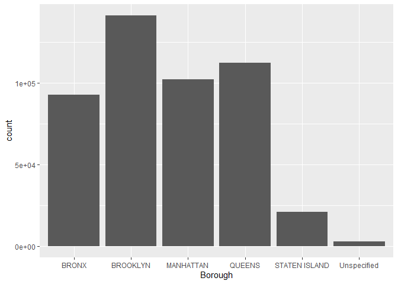
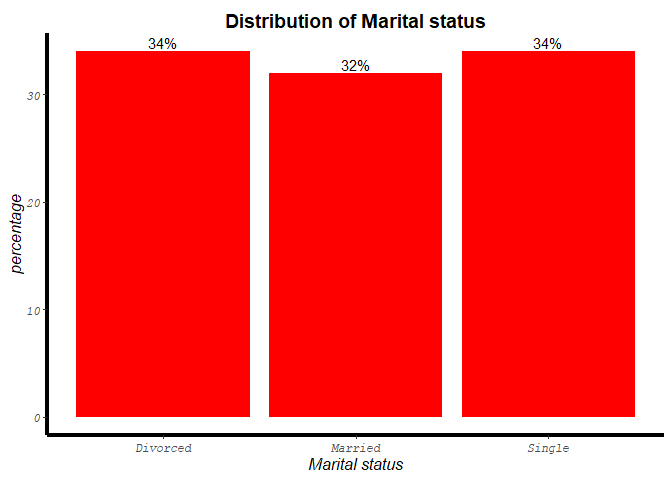

# R Programming

## Set Chunk requirements


```r
knitr::opts_chunk$set(echo = TRUE, message = FALSE, warning = FALSE)
#echo=FALSE indicates that the code will not be shown in the final document 
#(though any results/output would still be displayed).
#include=FALSE to have the chunk evaluated, but neither the code nor its output displayed
# warning=FALSE and message=FALSE suppress any R warnings or messages from being included 
#in the final document
```

Load Relevant Packages and Data Set


```r
setwd('E:/Documents/Reinp/GitHub Respositories/ggplot2_package')

library(tidyverse)
## tidyverse includes readr, ggplot2, dplyr, forcats, tibble, tidyr, purrr, stringr

data("iris") #load Datasets distributed with R
View(iris)

iris
```

```
##     Sepal.Length Sepal.Width Petal.Length Petal.Width    Species
## 1            5.1         3.5          1.4         0.2     setosa
## 2            4.9         3.0          1.4         0.2     setosa
## 3            4.7         3.2          1.3         0.2     setosa
## 4            4.6         3.1          1.5         0.2     setosa
## 5            5.0         3.6          1.4         0.2     setosa
## 6            5.4         3.9          1.7         0.4     setosa
## 7            4.6         3.4          1.4         0.3     setosa
## 8            5.0         3.4          1.5         0.2     setosa
## 9            4.4         2.9          1.4         0.2     setosa
## 10           4.9         3.1          1.5         0.1     setosa
## 11           5.4         3.7          1.5         0.2     setosa
## 12           4.8         3.4          1.6         0.2     setosa
## 13           4.8         3.0          1.4         0.1     setosa
## 14           4.3         3.0          1.1         0.1     setosa
## 15           5.8         4.0          1.2         0.2     setosa
## 16           5.7         4.4          1.5         0.4     setosa
## 17           5.4         3.9          1.3         0.4     setosa
## 18           5.1         3.5          1.4         0.3     setosa
## 19           5.7         3.8          1.7         0.3     setosa
## 20           5.1         3.8          1.5         0.3     setosa
## 21           5.4         3.4          1.7         0.2     setosa
## 22           5.1         3.7          1.5         0.4     setosa
## 23           4.6         3.6          1.0         0.2     setosa
## 24           5.1         3.3          1.7         0.5     setosa
## 25           4.8         3.4          1.9         0.2     setosa
## 26           5.0         3.0          1.6         0.2     setosa
## 27           5.0         3.4          1.6         0.4     setosa
## 28           5.2         3.5          1.5         0.2     setosa
## 29           5.2         3.4          1.4         0.2     setosa
## 30           4.7         3.2          1.6         0.2     setosa
## 31           4.8         3.1          1.6         0.2     setosa
## 32           5.4         3.4          1.5         0.4     setosa
## 33           5.2         4.1          1.5         0.1     setosa
## 34           5.5         4.2          1.4         0.2     setosa
## 35           4.9         3.1          1.5         0.2     setosa
## 36           5.0         3.2          1.2         0.2     setosa
## 37           5.5         3.5          1.3         0.2     setosa
## 38           4.9         3.6          1.4         0.1     setosa
## 39           4.4         3.0          1.3         0.2     setosa
## 40           5.1         3.4          1.5         0.2     setosa
## 41           5.0         3.5          1.3         0.3     setosa
## 42           4.5         2.3          1.3         0.3     setosa
## 43           4.4         3.2          1.3         0.2     setosa
## 44           5.0         3.5          1.6         0.6     setosa
## 45           5.1         3.8          1.9         0.4     setosa
## 46           4.8         3.0          1.4         0.3     setosa
## 47           5.1         3.8          1.6         0.2     setosa
## 48           4.6         3.2          1.4         0.2     setosa
## 49           5.3         3.7          1.5         0.2     setosa
## 50           5.0         3.3          1.4         0.2     setosa
## 51           7.0         3.2          4.7         1.4 versicolor
## 52           6.4         3.2          4.5         1.5 versicolor
## 53           6.9         3.1          4.9         1.5 versicolor
## 54           5.5         2.3          4.0         1.3 versicolor
## 55           6.5         2.8          4.6         1.5 versicolor
## 56           5.7         2.8          4.5         1.3 versicolor
## 57           6.3         3.3          4.7         1.6 versicolor
## 58           4.9         2.4          3.3         1.0 versicolor
## 59           6.6         2.9          4.6         1.3 versicolor
## 60           5.2         2.7          3.9         1.4 versicolor
## 61           5.0         2.0          3.5         1.0 versicolor
## 62           5.9         3.0          4.2         1.5 versicolor
## 63           6.0         2.2          4.0         1.0 versicolor
## 64           6.1         2.9          4.7         1.4 versicolor
## 65           5.6         2.9          3.6         1.3 versicolor
## 66           6.7         3.1          4.4         1.4 versicolor
## 67           5.6         3.0          4.5         1.5 versicolor
## 68           5.8         2.7          4.1         1.0 versicolor
## 69           6.2         2.2          4.5         1.5 versicolor
## 70           5.6         2.5          3.9         1.1 versicolor
## 71           5.9         3.2          4.8         1.8 versicolor
## 72           6.1         2.8          4.0         1.3 versicolor
## 73           6.3         2.5          4.9         1.5 versicolor
## 74           6.1         2.8          4.7         1.2 versicolor
## 75           6.4         2.9          4.3         1.3 versicolor
## 76           6.6         3.0          4.4         1.4 versicolor
## 77           6.8         2.8          4.8         1.4 versicolor
## 78           6.7         3.0          5.0         1.7 versicolor
## 79           6.0         2.9          4.5         1.5 versicolor
## 80           5.7         2.6          3.5         1.0 versicolor
## 81           5.5         2.4          3.8         1.1 versicolor
## 82           5.5         2.4          3.7         1.0 versicolor
## 83           5.8         2.7          3.9         1.2 versicolor
## 84           6.0         2.7          5.1         1.6 versicolor
## 85           5.4         3.0          4.5         1.5 versicolor
## 86           6.0         3.4          4.5         1.6 versicolor
## 87           6.7         3.1          4.7         1.5 versicolor
## 88           6.3         2.3          4.4         1.3 versicolor
## 89           5.6         3.0          4.1         1.3 versicolor
## 90           5.5         2.5          4.0         1.3 versicolor
## 91           5.5         2.6          4.4         1.2 versicolor
## 92           6.1         3.0          4.6         1.4 versicolor
## 93           5.8         2.6          4.0         1.2 versicolor
## 94           5.0         2.3          3.3         1.0 versicolor
## 95           5.6         2.7          4.2         1.3 versicolor
## 96           5.7         3.0          4.2         1.2 versicolor
## 97           5.7         2.9          4.2         1.3 versicolor
## 98           6.2         2.9          4.3         1.3 versicolor
## 99           5.1         2.5          3.0         1.1 versicolor
## 100          5.7         2.8          4.1         1.3 versicolor
## 101          6.3         3.3          6.0         2.5  virginica
## 102          5.8         2.7          5.1         1.9  virginica
## 103          7.1         3.0          5.9         2.1  virginica
## 104          6.3         2.9          5.6         1.8  virginica
## 105          6.5         3.0          5.8         2.2  virginica
## 106          7.6         3.0          6.6         2.1  virginica
## 107          4.9         2.5          4.5         1.7  virginica
## 108          7.3         2.9          6.3         1.8  virginica
## 109          6.7         2.5          5.8         1.8  virginica
## 110          7.2         3.6          6.1         2.5  virginica
## 111          6.5         3.2          5.1         2.0  virginica
## 112          6.4         2.7          5.3         1.9  virginica
## 113          6.8         3.0          5.5         2.1  virginica
## 114          5.7         2.5          5.0         2.0  virginica
## 115          5.8         2.8          5.1         2.4  virginica
## 116          6.4         3.2          5.3         2.3  virginica
## 117          6.5         3.0          5.5         1.8  virginica
## 118          7.7         3.8          6.7         2.2  virginica
## 119          7.7         2.6          6.9         2.3  virginica
## 120          6.0         2.2          5.0         1.5  virginica
## 121          6.9         3.2          5.7         2.3  virginica
## 122          5.6         2.8          4.9         2.0  virginica
## 123          7.7         2.8          6.7         2.0  virginica
## 124          6.3         2.7          4.9         1.8  virginica
## 125          6.7         3.3          5.7         2.1  virginica
## 126          7.2         3.2          6.0         1.8  virginica
## 127          6.2         2.8          4.8         1.8  virginica
## 128          6.1         3.0          4.9         1.8  virginica
## 129          6.4         2.8          5.6         2.1  virginica
## 130          7.2         3.0          5.8         1.6  virginica
## 131          7.4         2.8          6.1         1.9  virginica
## 132          7.9         3.8          6.4         2.0  virginica
## 133          6.4         2.8          5.6         2.2  virginica
## 134          6.3         2.8          5.1         1.5  virginica
## 135          6.1         2.6          5.6         1.4  virginica
## 136          7.7         3.0          6.1         2.3  virginica
## 137          6.3         3.4          5.6         2.4  virginica
## 138          6.4         3.1          5.5         1.8  virginica
## 139          6.0         3.0          4.8         1.8  virginica
## 140          6.9         3.1          5.4         2.1  virginica
## 141          6.7         3.1          5.6         2.4  virginica
## 142          6.9         3.1          5.1         2.3  virginica
## 143          5.8         2.7          5.1         1.9  virginica
## 144          6.8         3.2          5.9         2.3  virginica
## 145          6.7         3.3          5.7         2.5  virginica
## 146          6.7         3.0          5.2         2.3  virginica
## 147          6.3         2.5          5.0         1.9  virginica
## 148          6.5         3.0          5.2         2.0  virginica
## 149          6.2         3.4          5.4         2.3  virginica
## 150          5.9         3.0          5.1         1.8  virginica
```

```r
head(iris)
```

```
##   Sepal.Length Sepal.Width Petal.Length Petal.Width Species
## 1          5.1         3.5          1.4         0.2  setosa
## 2          4.9         3.0          1.4         0.2  setosa
## 3          4.7         3.2          1.3         0.2  setosa
## 4          4.6         3.1          1.5         0.2  setosa
## 5          5.0         3.6          1.4         0.2  setosa
## 6          5.4         3.9          1.7         0.4  setosa
```

```r
tail(iris)
```

```
##     Sepal.Length Sepal.Width Petal.Length Petal.Width   Species
## 145          6.7         3.3          5.7         2.5 virginica
## 146          6.7         3.0          5.2         2.3 virginica
## 147          6.3         2.5          5.0         1.9 virginica
## 148          6.5         3.0          5.2         2.0 virginica
## 149          6.2         3.4          5.4         2.3 virginica
## 150          5.9         3.0          5.1         1.8 virginica
```

```r
# How many variables and observations are there?
ncol(iris)
```

```
## [1] 5
```

```r
nrow(iris)
```

```
## [1] 150
```

```r
#learn more about the dataset
help(iris)
??iris
str(iris)
```

```
## 'data.frame':	150 obs. of  5 variables:
##  $ Sepal.Length: num  5.1 4.9 4.7 4.6 5 5.4 4.6 5 4.4 4.9 ...
##  $ Sepal.Width : num  3.5 3 3.2 3.1 3.6 3.9 3.4 3.4 2.9 3.1 ...
##  $ Petal.Length: num  1.4 1.4 1.3 1.5 1.4 1.7 1.4 1.5 1.4 1.5 ...
##  $ Petal.Width : num  0.2 0.2 0.2 0.2 0.2 0.4 0.3 0.2 0.2 0.1 ...
##  $ Species     : Factor w/ 3 levels "setosa","versicolor",..: 1 1 1 1 1 1 1 1 1 1 ...
```

```r
class(iris)
```

```
## [1] "data.frame"
```

```r
typeof(iris) 
```

```
## [1] "list"
```

```r
length(iris)
```

```
## [1] 5
```

```r
names(iris) #display variable names
```

```
## [1] "Sepal.Length" "Sepal.Width"  "Petal.Length" "Petal.Width"  "Species"
```

```r
#attributes(iris) #names(iris), class(iris), row.names(iris)

#ggplot2::geom
```


## Scatter/Dot plots


```r
ggplot(data = iris, 
       mapping = aes(x = Sepal.Length,
                     y = Petal.Length,
                    )) + geom_point()
```

<!-- -->

```r
## Compared to base R scatter plot
plot(Petal.Length~Sepal.Length, data = iris)
```

<!-- -->

```r
### Now adding some colour to the scatter plot 

ggplot(iris, 
       aes(x = Sepal.Length,
           y = Petal.Length,
           colour = Species)) + 
  geom_point()
```

<!-- -->

```r
### Making both the colour and shape based on Species
ggplot(iris,
       aes(x = Sepal.Length, 
           y = Petal.Length, 
           colour = Species, 
           shape = Species)) + geom_point()
```

<!-- -->

## Histograms


```r
### Making a histogram of petal lengths
ggplot(data = iris,
       mapping = aes(x = Petal.Length)) +
  geom_histogram(fill = "lightblue", colour = "black")
```

<!-- -->

```r
ggplot(data = iris,
       mapping = aes(x = Petal.Length
                     )) + 
  geom_histogram(fill = "blue", colour = "black")
```

<!-- -->

```r
### Using species with histogram fill
ggplot(data = iris,
       mapping = aes(x = Petal.Length,
                     fill = Species)) + 
  geom_histogram(colour = "black")
```

<!-- -->

```r
### Using position as identity
ggplot(data = iris, 
       mapping = aes(x = Petal.Length,
                     fill = Species)) + 
  geom_histogram(position = "identity", colour = "black", 
                 alpha = 0.4)
```

<!-- -->

```r
#changing the default stacking of groups and adding transparency

ggplot(data = iris, 
       aes(x = Petal.Length, 
           fill = Species)) + geom_histogram(position = "identity",
                                             alpha = 0.6)
```

<!-- -->

```r
ggplot(data = iris,
       mapping = aes(x = Petal.Length,
                     fill = Species)) + 
  geom_density(alpha = 0.5) 
```

<!-- -->

```r
mean(iris$Petal.Length)
```

```
## [1] 3.758
```

```r
sd(iris$Petal.Length)
```

```
## [1] 1.765298
```

## Box Plots


```r
### Making a box plot to compare petal lengths of different species

ggplot(data = iris,
       aes(x = Species,
           y = Petal.Length)) + 
  geom_boxplot()
```

<!-- -->

```r
### Violin plot 

ggplot(data = iris,
       aes(x = Species, 
          y = Petal.Length)) + 
  geom_violin()
```

<!-- -->

## Bargraphs

### Bar graphs with counts


```r
nyc311 <- read_csv("data/nyc311_Jan-March2020.csv")


### Which borough has the most complaints?

## base R 
table(nyc311$Borough)
```

```
## 
##         BRONX      BROOKLYN     MANHATTAN        QUEENS STATEN ISLAND 
##         92758        141397        102266        112549         20890 
##   Unspecified 
##          2632
```

```r
## USing dplyr
count(nyc311, Borough, sort = TRUE)
```

```
## # A tibble: 6 x 2
##   Borough            n
##   <chr>          <int>
## 1 BROOKLYN      141397
## 2 QUEENS        112549
## 3 MANHATTAN     102266
## 4 BRONX          92758
## 5 STATEN ISLAND  20890
## 6 Unspecified     2632
```

```r
### How to make a bar chart
## data: nyc311
## aesthetic: x: Borough, 

ggplot(data = nyc311, 
       aes(x = Borough)
       ) + geom_bar() 
```

<!-- -->

```r
library(scales) #to get the comma label 

ggplot(data = nyc311, 
       aes(x = Borough)) +
  geom_bar(fill = "royalblue") + scale_y_continuous(label = comma)
```

<!-- -->

```r
### Which agencies get the most complaints?

ggplot(data = nyc311,
       aes(x = Agency)) + 
  geom_bar(fill = "blue") + scale_y_continuous(label = comma) +
  coord_flip()
```

<!-- -->

```r
## fct_lump is in the forcats package - for dealing with factors which is included in the tidyverse 

nyc311_fct_lump <- mutate(nyc311, Agency2 = fct_lump(Agency, 5))

ggplot(data = nyc311_fct_lump,
       aes(x = Agency2)) +
  geom_bar(fill = "blue") + scale_y_continuous(label = comma)
```

<!-- -->

### Bar graphs with totals


```r
chicago <- read_csv("data/ChicagoEmployees2020.csv")
chicago <- mutate(chicago, Dept = fct_lump(Department, 4)) 

count(chicago, Dept)
```

```
## # A tibble: 5 x 2
##   Dept              n
##   <fct>         <int>
## 1 FIRE           4627
## 2 POLICE        13848
## 3 STREETS & SAN  2175
## 4 WATER MGMNT    1914
## 5 Other         11138
```

```r
### bar chart of number of employees
ggplot(data = chicago, 
       aes(x = Dept)) + geom_bar()  #  stat = "count" for the default value
```

<!-- -->

```r
ggplot(data = chicago, 
       aes(x = Dept, y = AnnSalary)) + geom_bar(stat = "identity") + 
  ggtitle("Annual Salaries of Chicago Employees") + xlab("Department") + 
  ylab("Total Salaries") + 
  theme(plot.title = element_text(size = 16, face = "bold", color = "red", hjust = 0.5))
```

<!-- -->

```r
ggplot(data = chicago,
       aes(x = Dept, y = AnnSalary)) + geom_col()
```

<!-- -->

```r
ggplot(data = chicago,
       aes(x = Dept,  y = AnnSalary)) + stat_identity(shape = 21) 
```

<!-- -->


## Line graphs


```r
str(nyc311_fct_lump)
```

```
## tibble [472,492 x 8] (S3: spec_tbl_df/tbl_df/tbl/data.frame)
##  $ Created Date  : chr [1:472492] "01/01/2020 01:00:00 AM" "01/01/2020 01:00:28 AM" "01/01/2020 01:00:28 AM" "01/01/2020 01:00:48 AM" ...
##  $ Agency        : chr [1:472492] "DOT" "NYPD" "NYPD" "NYPD" ...
##  $ Complaint Type: chr [1:472492] "Traffic Signal Condition" "Noise - Residential" "Noise - Residential" "Noise - Residential" ...
##  $ Incident Zip  : num [1:472492] NA 10459 10465 11375 10040 ...
##  $ Borough       : chr [1:472492] "MANHATTAN" "BRONX" "BRONX" "QUEENS" ...
##  $ Latitude      : num [1:472492] NA 40.8 40.8 40.7 40.9 ...
##  $ Longitude     : num [1:472492] NA -73.9 -73.8 -73.8 -73.9 ...
##  $ Agency2       : Factor w/ 6 levels "DEP","DOT","DSNY",..: 2 5 5 5 5 1 5 5 5 5 ...
```

```r
library(lubridate)

nyc311_2 <- mutate(nyc311_fct_lump, datetime = mdy_hms(`Created Date`),
                 day = as_date(datetime),
                 weekday = weekdays(day))

grouped_data <- group_by(nyc311_2, day, Agency2) #groups the data frame by day and agency
report <- summarise(grouped_data, Calls = n())

### Make a line graph
ggplot(data = report, aes(x = day, 
                          y = Calls,
                          group = Agency2,
                          colour = Agency2)) +
  geom_line()
```

<!-- -->

```r
### We can facet 
ggplot(data = report, aes(x = day, y = Calls)) +
  geom_line() + facet_wrap(~Agency2, ncol = 2) + theme_bw()
```

<!-- -->

```r
grouped_agencyboro <- group_by(nyc311_2, day, Agency2, Borough)
report2 <- summarise(grouped_agencyboro, Calls = n())

ggplot(data = report2, 
       aes(x = day, y = Calls)) + 
  geom_line() + facet_grid(Agency2~Borough) + 
  theme_bw()
```

<!-- -->


